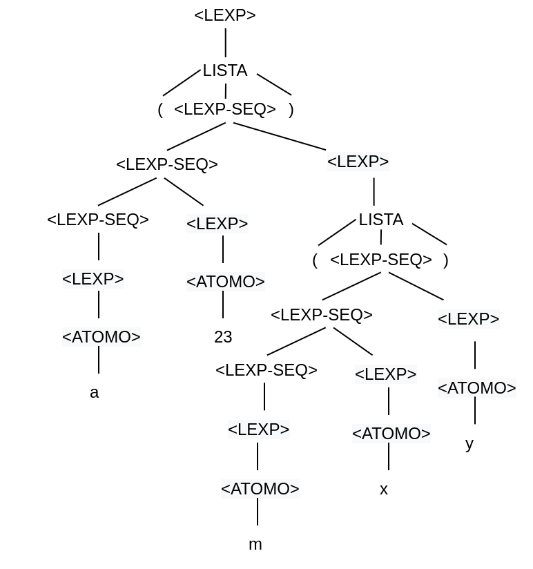

# Atividade 05 de Linguagens de Programação
## Nome: Johnny Marcos Silva Soares
## Matrícula: 385161
## Data: 13/01/2021

### Questão 01: 


```
<LEXP> -> <ATOMO> | <LISTA>
<ATOMO> -> numero | identificador
<LISTA> -> ( <LEXP-SEQ> )
<LEXP-SEQ> -> <LEXP-SEQ> <LEXP> | <LEXP>
```

#### 1. Escreva derivações à esquerda e à direita para a sentença (a 23 (m x y)).

Derivação à esquerda

```
<LEXP> => <LISTA>
=> ( <LEXP-SEQ> )
=> ( <LEXP-SEQ> <LEXP> )
=> ( <LEXP-SEQ> <LEXP> <LEXP> )
=> ( <LEXP> <LEXP> <LEXP> )
=> ( <ATOMO> <LEXP> <LEXP> )
=> ( a <LEXP> <LEXP> )
=> ( a <ATOMO> <LEXP> )
=> ( a 23 <LEXP> )
=> ( a 23 <LISTA> )
=> ( a 23 ( <LEXP-SEQ> ) )
=> ( a 23 ( <LEXP-SEQ> <LEXP> ) )
=> ( a 23 ( <LEXP-SEQ> <LESP> <LEXP> ) )
=> ( a 23 ( <LESP> <LESP> <LESP> ) )
=> ( a 23 ( <ATOMO> <LESP> <LESP> ) )
=> ( a 23 ( m <LEXP> <LEXP> ) )
=> ( a 23 ( m <ATOMO> <LEXP> ) )
=> ( a 23 ( m x <LEXP> ) )
=> ( a 23 ( m x <ATOMO> ) )
=> ( a 23 ( m x y ) )
```

Derivação à direita

```
<LEXP> => <LISTA>
=> ( <LEXP-SEQ> )
=> ( <LEXP-SEQ> <LEXP> )
=> ( <LEXP-SEQ> <LISTA> )
=> ( <LEXP-SEQ> ( <LEXP-SEQ> ) )
=> ( <LEXP-SEQ> ( <LEXP-SEQ> <LEXP> ) )
=> ( <LEXP-SEQ> ( <LEXP-SEQ> <ATOMO> ) )
=> ( <LEXP-SEQ> ( <LEXP-SEQ> y ) )
=> ( <LEXP-SEQ> ( <LEXP-SEQ> <LEXP> y ) )
=> ( <LEXP-SEQ> ( <LEXP-SEQ> <ATOMO> y ) )
=> ( <LEXP-SEQ> ( <LEXP-SEQ> x y ) )
=> ( <LEXP-SEQ> ( <LEXP> x y ) )
=> ( <LEXP-SEQ> ( <ATOMO> x y ) )
=> ( <LEXP-SEQ> ( m x y ) )
=> ( <LEXP-SEQ> <LEXP> ( m x y ) )
=> ( <LEXP-SEQ> <ATOMO> ( m x y ) )
=> ( <LEXP-SEQ> 23 ( m x y ) )
=> ( <LEXP> 23 ( m x y ) )
=> ( <ATOMO> 23 ( m x y ) )
=> ( a 23 ( m x y ) )
```

#### 2. Desenhe uma árvore de análise sintática para a sentença do item anterior.


