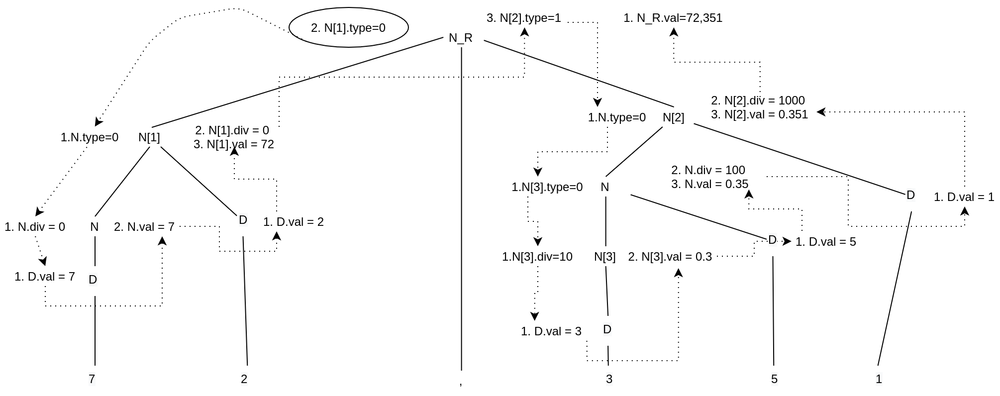

# Atividade 07 de Linguagens de Programação
## Nome: Johnny Marcos Silva Soares
## Matrícula: 385161
## Data: 13/01/2021
## Correção: 1,5
### Questão 01:


```
1.  Regra sintática: <NÚMERO_REAL> -> <NÚMERO> , <NÚMERO>
    Regra semântica 1: <NÚMERO_REAL>.val <- <NÚMERO>[1].val + <NÚMERO>[2].val
    Regra semântica 2: <NÚMERO>[1].type <- 0
    Regra semântica 3: <NÚMERO>[2].type <- 1
                    
2.  Regra sintática: <NÚMERO> -> <NÚMERO> <DÍGITO> 
    Regra semântica 1: <NÚMERO>[2].type <- <NÚMERO>[1].type
    Regra semântica 2: <NÚMERO>[1].div <- if ( <NÚMERO>[1].type = 1 )
                                            then <NÚMERO>[2].div * 10
                                          else 0
    Regra semântica 3: <NÚMERO>[1].val  <- if ( <NÚMERO>[1].type = 0 )
                                            then <NÚMERO>[2].val * 10 + <DÍGITO>.val
                                           else <NÚMERO>[2].val + <DÍGITO>.val/<NÚMERO>[1].div
                                         
3.  Regra sintática: <NÚMERO> -> <DÍGITO>
    Regra semântica 1: <NÚMERO>.div <- if ( <NÚMERO>.type = 1 )
                                           then 10
                                         else 0
    Regra semântica 2: <NÚMERO>.val <- if ( <NÚMERO>.type = 0 )
                                        then <DÍGITO>.val
                                       else <DÍGITO>.val / <NÚMERO>.div
    
4.  Regra sintática: <DÍGITO> -> 0 
    Regra semântica: <DÍGITO>.val <- 0
                   .
                   . 
                   .
13. Regra sintática: <DÍGITO> -> 9
    Regra semântica: <DÍGITO>.val <- 9
```

Arvore do valor 72,351


